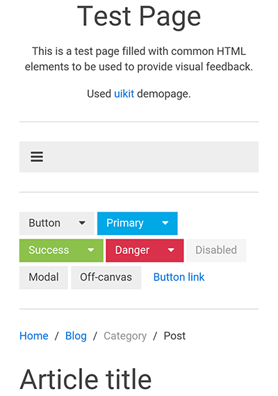

Appium
==========
# READ FIRST
**This documentation explains how PixDiff can work with Appium. It will not explain how to install Appium or how to automate with Appium, please refer to the Appium documentation on the Appium site.**

PixDiff is tested with: 

* iOS simulators with Safari (see iOS config below)
* Samsung Galaxy S4 physical device with Chrome and Android Emulator Nexus 6 (default from AVD, see Android config below)

**Creating screenshots / region screenshots with the above configurations work. It is not tested with a Hybrid App.**
 
 
# iOS
## How screenshots works for iOS
Appium creates a screenshot of the complete screen of the device. When a screenshot of Safari is made, the screenshot can hold the following elements:

* Statusbar (the "small" top bar that will hold time, wifi, battery, ...)
* Addressbar (the bar that will hold the url)
* View (the actual view of the page you are visiting)
* Toolbar (will hold additional buttons for the browser)

See "Scrolling" for the behaviour of Safari and the screenshots below for the influence
The `saveScreen` and `checkScreen` methods use the complete screen, see below. 
The `saveRegion` and `checkScreen` also use the complete screenshot, but the position of the element on the screenshot may differ.
If for example the position after a scroll is not determined correctly it can fail, see .
The iOS method is smart enough to detect the way of scrolling and the position of the element on the page.

## Scrolling
### Manually
When a user scrolls the screen manually the the addressbar and the Toolbar are influenced by this behaviour. For Safari the addressbar is made smaller and the toolbar is minimized.
### Javascript
When the scroll is automated with a Javascript scroll `browser.executeScript('arguments[0].scrollIntoView();', element(by.css('div h1')).getWebElement());` the view is scrolled, but the addressbar AND the toolbar **ARE NOT INFLUENCED** BY THIS BEHAVIOUR.
### Simulate
When the scroll is automated with a "native Appium" command the real use scroll is simulated and the behaviour of the addressbar and toolbar is the same as the manual scroll

## saveScreen / checkScreen
###### Not scrolled:


###### Manual / Simulated scroll:


###### Javascript scroll: 


## saveScreen / checkRegion
###### Not scrolled:


###### Manual / Simulated scroll:


###### Javascript scroll:


## Capabilities iOS

```
{
    browserName: 'safari',   // {mandatory} not case sensitive
    deviceName: 'iPhone 6',  // {mandatory} Needs to be form the list of available devices
    platformName: 'ios',     // {mandatory} not case sensitive
    platformVersion: '9.3'  // {optional} needed for specific ios version, else takes the default
}
```
# Android
## Browser
Appium can **ONLY** automate **Chrome** on Android. The stockbrowser **CAN"T** be used. When an Emulator is used Chrome is only default provided from Android > 7.0.
If an older version of Android needs to be used Chrome needs to be manually installed. Execute the following steps to install Chrome on Android < 7.0

* Download a Chrome APK from (APKMirror)[http://www.apkmirror.com/apk/google-inc/chrome/], check which processor is used in the Emulator (ARM or X86, X86 is faster).
* Open the Emulator
* Install the `chrome.apk` from the folder where it is saved with the following command `adb install chrome.apk`. 

`````
[100%] /data/local/tmp/chrome.apk
       	pkg: /data/local/tmp/chrome.apk
Success
`````

* When the message `Success` is shown `Chrome` is installed on the device.

## How screenshots work on Android
Appium can create 2 types of screenshots for Android based on:
- Chromedriver (default)
- ADB (Appium >= 1.5.3)

### Chromedriver (default)
Chromedriver creates a screenshot of the **(visible)viewport**

![Chromedriver saveScreen / checkScreen] (./images/avdForNexus5ByGoogle_examplePage_ChromeDriver.png "Chromedriver saveScreen / checkScreen") 

### ADB (Appium >= 1.5.3)
ADB creates a screenshot of the **complete screen** (as iOS does with Safari).
This can be compared with the Native screenshot that can be made with a device. The ADB screenshot can hold:
* Statusbar (the "small" top bar that will hold time, wifi, battery, ...)
* Addressbar (the bar that will hold the url)
* View (the actual view of the page you are visiting)
* Toolbar (optional, will hold additional Android buttons, like home, back and menu) 

To use ADB screenshots add this in this capability in the capabilities `nativeWebScreenshot: true`, see "Capabilities Android" example below.

![ADB saveScreen / checkScreen] (./images/avdForNexus5ByGoogle_examplePage_ADB.png "ADB saveScreen / checkScreen") 

#### Note 1
It looks like taking a screenshot with ADB reacts different on a scroll (`elm.scrollIntoView()` seems to take more time). This is why a sleep is added after scrolling to be sure the screenshot is taken of the correct screen state

#### Note 2
See "Scrolling" for the behaviour of Chrome and the screenshots below for the influence

#### Scrolling with Chrome and ADB native screenshot

##### Manually
When a user scrolls the screen manually the the addressbar is influenced by this behaviour. For Chrome the addressbar is made smaller and the toolbar is minimized.
##### Javascript
When the scroll is automated with a Javascript scroll `browser.executeScript('arguments[0].scrollIntoView();', element(by.css('div h1')).getWebElement());` the view is scrolled, but the addressbar **IS NOT INFLUENCED** BY THIS BEHAVIOUR.
##### Simulate
When the scroll is automated with a "native Appium" command the real use scroll is simulated and the behaviour of the addressbar is the same as the manual scroll

##### saveScreen / checkScreen with ADB
###### Not scrolled:



###### Manual / Simulated scroll: 


###### Javascript scroll:


##### saveScreen / checkRegion
###### Not scrolled:


###### Manual / Simulated scroll: 


###### Javascript scroll:


## Capabilities Android

```
{
    browserName: 'chrome',                      // {mandatory} not case sensitive
    deviceName: 'AVD_for_Nexus_5_by_Google',    // {mandatory} Needs to be form the list of available devices
    platformName: 'android'                     // {mandatory} not case sensitive
    platformVersion: '7.0',                     // {optional} needed for specific Android version,
    nativeWebScreenshot: true                   // to use adb screenshots (complete screenshot), default is ChromeDriver
}
```